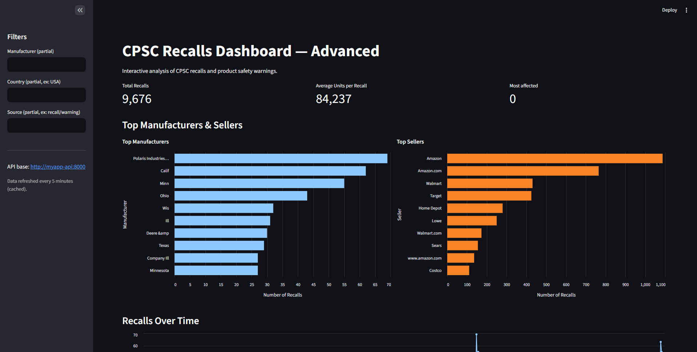
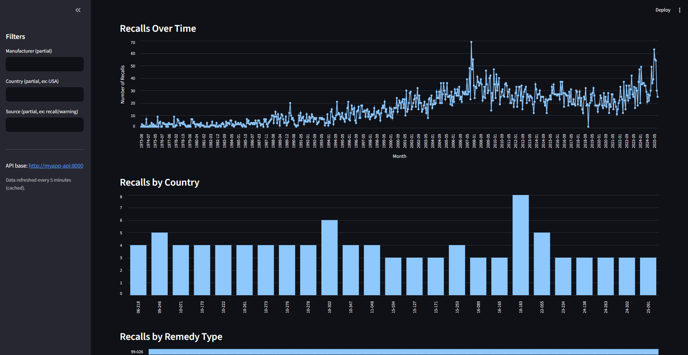

## CPSC Recalls & Safety Warnings Dashboard ⚠️
Important: Make sure your entrypoint.sh file uses LF line endings (Unix style) instead of CRLF, especially if you are on Windows. This ensures Docker containers run the script correctly.

## Minimal Requirements
Before running the project, make sure you have installed:

Python 3.9+ (with libraries listed in requirements.txt)

Docker & Docker Compose

Note: Selenium and ChromeDriver are managed inside the container, so you don't need Chrome installed locally.

## Project Description
This project collects product recall and safety warning data from the CPSC (Consumer Product Safety Commission), processes it into JSON, and persists it in InterSystems IRIS.

The project includes:

Python Scraper: Uses Selenium to automatically download CSVs of recalls and warnings.

Data Processing & Cleaning:

Normalizes names of manufacturers, importers, distributors, and retailers.

Converts dates, units, and other fields to consistent formats.

Persistence in IRIS: Automatically creates main (cpsc_data) and auxiliary tables (cpsc_sold_at, cpsc_importers, etc.).

Daily Scheduling: Scraper runs automatically at 10:00 PM using schedule.

Technologies Used
Python: Selenium, Pandas, Schedule

InterSystems IRIS (Community Edition via Docker)

Docker & Docker Compose

JSON & CSV for temporary storage

Streamlit for interactive dashboard

Altair / Pydeck for charts and maps

## Project Structure
.
├── api.py                 # FastAPI backend
├── cpsc_scraper.py        # Scraper + processing + persistence
├── dashboard.py           # Streamlit dashboard
├── docker-compose.yml
├── Dockerfile
├── entrypoint.sh          # Important: must use LF line endings
├── iris.script            # IRIS initialization script
├── requirements.txt
├── processed_cpsc_data.json
├── downloads/             # Temporary downloaded CSVs
├── storage/               # Persisted IRIS data
└── .env
The scraper saves temporary files in downloads/ and persists data in IRIS via storage/.

## How to Run
1. Clone the repository
Bash

git clone <REPOSITORY_URL>
cd <REPOSITORY_NAME>
## 2. Install Python dependencies
Bash

pip install -r requirements.txt
## 3. Execute Docker Compose
Bash

docker compose up --build -d
This command builds the images, starts the containers, collects data, and saves it automatically to IRIS.

The scraper is configured to run daily at 10:00 PM. To run it manually:

Bash

python cpsc_scraper.py
How It Works
The scraper accesses the CPSC website and downloads CSVs of Recalls and Product Safety Warnings.

CSV files are processed into JSON, extracting fields such as:

name_of_product, description, hazard_description

manufacturers, importers, distributors

sold_at, manufactured_in

Data is persisted in the main table cpsc_data and auxiliary tables (cpsc_sold_at, cpsc_importers, etc.) in IRIS.

Temporary CSV files are deleted after processing.

The Streamlit dashboard consumes the FastAPI backend to display interactive charts and filterable tables.

## Main Command
Bash

``docker compose up --build -d``
This builds the image, starts containers, collects data, and persists it in IRIS automatically.

## License
MIT License — Open Source. You can use, modify, and redistribute freely.